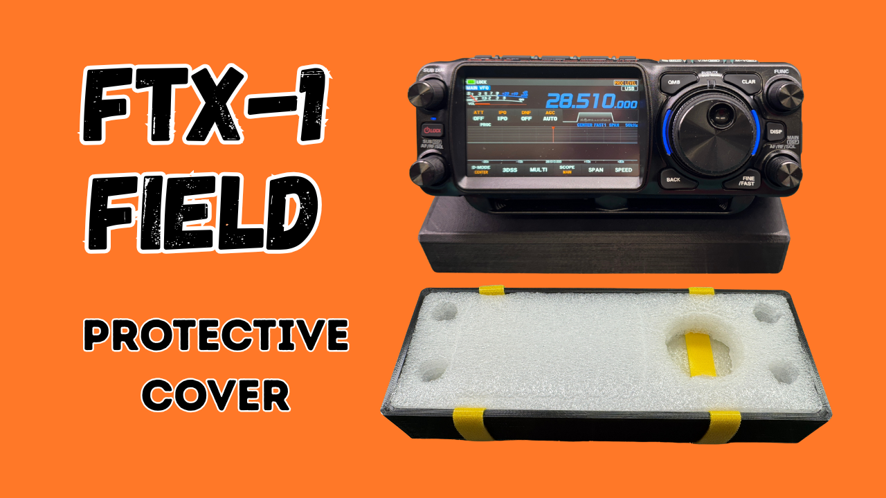
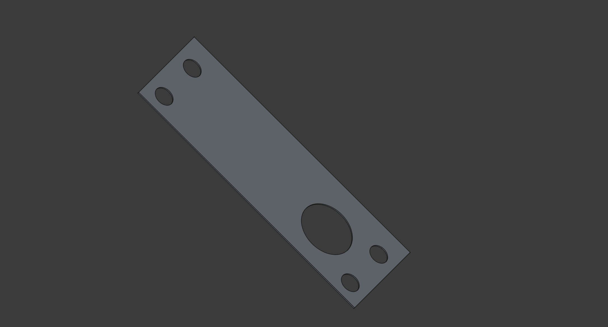
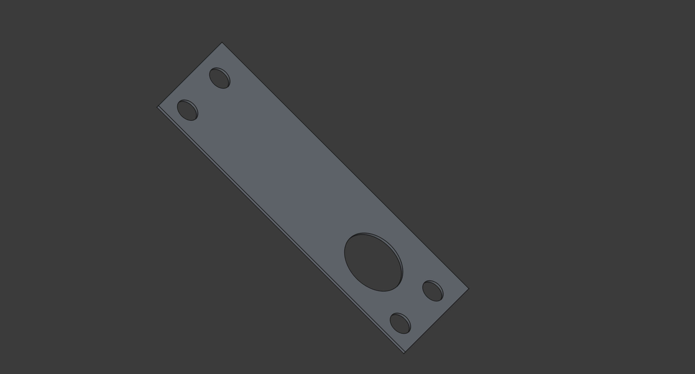

# FTX-1 Front Cover

This is the companion repository the the YouTube video showing the build of the protective front cover of the Yaesu FTX-1 Field

**Video will be published 2025-08-22 16:00 UTC**

## Polyethylene Foam (PE Foam) Template; A4

- [SVG: template-a4.svg](<template-a4.svg>)
- [STL: template-a4.pdf](<template-a4.pdf>)

## Polyethylene Foam (PE Foam) Template; US Letter

- [SVG: template-us-letter.svg](<template-us-letter.svg>)
- [STL: template-us-letter.pdf](<template-us-letter.pdf>)

## Polyethylene Foam (PE Foam) Template; FreeCAD and STL

- [foam-template.fcstd](<foam-template.fcstd>)

### 3D printable STL, 1mm thick

- [STL: foam-template-1mm.stl](<foam-template-1mm.stl>)

### 3D printable STL, 2mm thick

- [STL: foam-template-2mm.stl](<foam-template-2mm.stl>)

### 3D printable STL, 3mm thick

- [STL: foam-template-3mm.stl](<foam-template-3mm.stl>)

### 3D printable STL, 4mm thick

- [STL: foam-template-4mm.stl](<foam-template-4mm.stl>)

### 3D printable STL, 5mm thick

- [STL: foam-template-5mm.stl](<foam-template-5mm.stl>)

## FreeCAD source file (if you want to make chanegs)

- [ftx-1-front-cover.fcstd](<ftx-1-front-cover.fcstd>)

### 3D Printable Housing, 20 mm deep

- [SVG: ftx-1-front-cover-20mm.stl](<ftx-1-front-cover-20mm.stl>)

### 3D Printable Housing, 22 mm deep

- [SVG: ftx-1-front-cover-22mm.stl](<ftx-1-front-cover-22mm.stl>)

### 3D Printable Housing, 24 mm deep

- [SVG: ftx-1-front-cover-24mm.stl](<ftx-1-front-cover-24mm.stl>)

### 3D Printable Housing, 26 mm deep

- [SVG: ftx-1-front-cover-26mm.stl](<ftx-1-front-cover-26mm.stl>)

### 3D Printable Housing, 28 mm deep

- [SVG: ftx-1-front-cover-28mm.stl](<ftx-1-front-cover-28mm.stl>)

### 3D Printable Housing, 30 mm deep

- [SVG: ftx-1-front-cover-30mm.stl](<ftx-1-front-cover-30mm.stl>)

### 3D Printable Housing, 32 mm deep

- [SVG: ftx-1-front-cover-32mm.stl](<ftx-1-front-cover-32mm.stl>)

### 3D Printable Housing, 34 mm deep

- [SVG: ftx-1-front-cover-34mm.stl](<ftx-1-front-cover-34mm.stl>)

### 3D Printable Housing, 36 mm deep

- [SVG: ftx-1-front-cover-36mm.stl](<ftx-1-front-cover-36mm.stl>)

### 3D Printable Housing, 38 mm deep

- [SVG: ftx-1-front-cover-38mm.stl](<ftx-1-front-cover-38mm.stl>)

### 3D Printable Housing, 40 mm deep

- [SVG: ftx-1-front-cover-40mm.stl](<ftx-1-front-cover-40mm.stl>)

